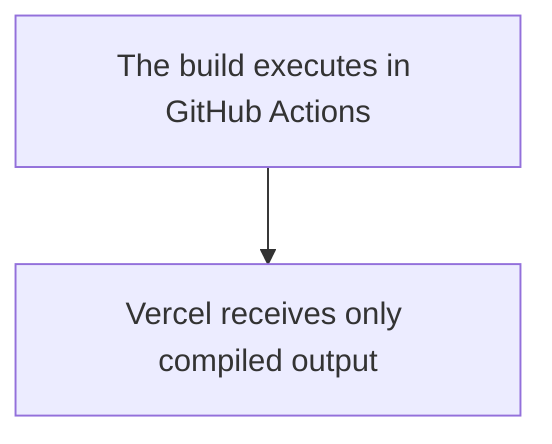

import { Mermaid } from '@/components/mdx/mermaid';
import { GithubInfo } from 'fumadocs-ui/components/github-info';
import { Tab, Tabs } from 'fumadocs-ui/components/tabs';

## What's the problem?

In a monorepo, Vercel runs a build on every push. It doesn’t care what changed.

If you update a backend service or touch something unrelated, the frontend still gets rebuilt. That’s fine in small repos. Once the repo grows, it becomes wasteful. Builds pile up, previews get blocked, and free tier limits disappear fast.

I hit this while deploying a Next.js app from a monorepo that also contains a few microservices running on Google Cloud Run.


In the default configuration:

- Every push triggers a build
- Every build consumes Vercel compute minutes
- Builds are serialized on the free tier
- Unrelated changes still incur cost

This results in delayed deployments, blocked previews, and rapid exhaustion of free tier limits.  
On paid tiers, the same behavior quietly inflates monthly usage.

## Why not use Vercel's automatic builds?

Allowing Vercel to build on every push was rejected for the following reasons:

- No path level filtering
- No build reuse across deployments
- No control over when compute is consumed
- Cost is incurred at build time, not at deploy time

This approach optimizes for convenience, not system efficiency.

## Why not use Ignore Build step?

We can use the ignore build step to prevent Vercel from building the project on every push, but it still have some drawbacks, especially for someone who is low on budget,
and want to keep thier application portable to any platform, instead of using bunch of script with Vercel's environment variables and tracking. 

Also, it does clone the repository once and evently <code>cancelling</code> the build process, adding up to the limited compute for the tier.


## What constraints I had?

- Monorepo with multiple applications
- Only `apps/platform` should trigger deployments
- Can also have preview deployments
- Production deployments must be deterministic
- Free tier usage must remain viable


## What's the solution then?

**Vercel charges for build compute, not for serving prebuilt artifacts.**

Once build and deploy are separated, Vercel becomes a hosting layer rather than a CI system.  
This separation is the primary leverage point for cost control.

### Architecture Overview

<Mermaid chart={`
flowchart
    A[GitHub Push or Pull Request] --> B[GitHub Actions Runner]
    B --> C[Application Build]
    C --> D[Prebuilt Output]
`} />

#### Actual process



### Workflow Implementation

<Tabs items={['Github', 'Code']}>
  <Tab value="github">
  <GithubInfo owner="kanakkholwal" repo="github-workflows" className="lg:-mx-2 flex-row" />

  </Tab>
  <Tab value="code">
    
```yaml title="nextjs-to-vercel.yml"
name: Deploy to Vercel - Platform

on:
  push:
    branches:
      - main
    paths:
      - 'apps/platform/**'
  pull_request:
    branches:
      - main
    paths:
      - 'apps/platform/**'
  workflow_dispatch:

env:
  VERCEL_ORG_ID: ${{ secrets.VERCEL_ORG_ID }}
  VERCEL_PROJECT_ID: ${{ secrets.VERCEL_PROJECT_ID }}

jobs:
  deploy:
    runs-on: ubuntu-latest

    defaults:
      run:
        working-directory: apps/platform

    steps:
      - name: Checkout code
        uses: actions/checkout@v4

      - name: Setup Bun
        uses: oven-sh/setup-bun@v1
        with:
          bun-version: latest

      - name: Install dependencies
        run: bun install

      - name: Run linter
        run: bun run lint
        continue-on-error: true

      - name: Run tests
        run: bun test
        continue-on-error: true

      - name: Install Vercel CLI
        run: bun install --global vercel@latest
        working-directory: .

      - name: Deploy to Vercel Production
        if: github.ref == 'refs/heads/main' && (github.event_name == 'push' || github.event_name == 'workflow_dispatch')
        run: |
          vercel pull --yes --environment=production --token=${{ secrets.VERCEL_TOKEN }}
          vercel build --prod --token=${{ secrets.VERCEL_TOKEN }}
          vercel deploy --prebuilt --prod --token=${{ secrets.VERCEL_TOKEN }}

      - name: Deploy to Vercel Preview
        if: github.event_name == 'pull_request' && github.ref == 'refs/heads/main'
        run: |
          vercel pull --yes --environment=preview --token=${{ secrets.VERCEL_TOKEN }}
          vercel build --token=${{ secrets.VERCEL_TOKEN }}
          vercel deploy --prebuilt --token=${{ secrets.VERCEL_TOKEN }}

```
  </Tab>
</Tabs>

## Conclusion

Vercel’s defaults are convenient, but they assume every commit deserves a build. In a monorepo, that’s rarely true.

Moving the build step into GitHub Actions lets you decide when a build should happen. Vercel only receives the output and deploys it. That alone cuts down wasted compute and avoids blocked deployments.

But if you’re running a monorepo and trying to keep build usage under control, separating build and deploy is hard to avoid.
